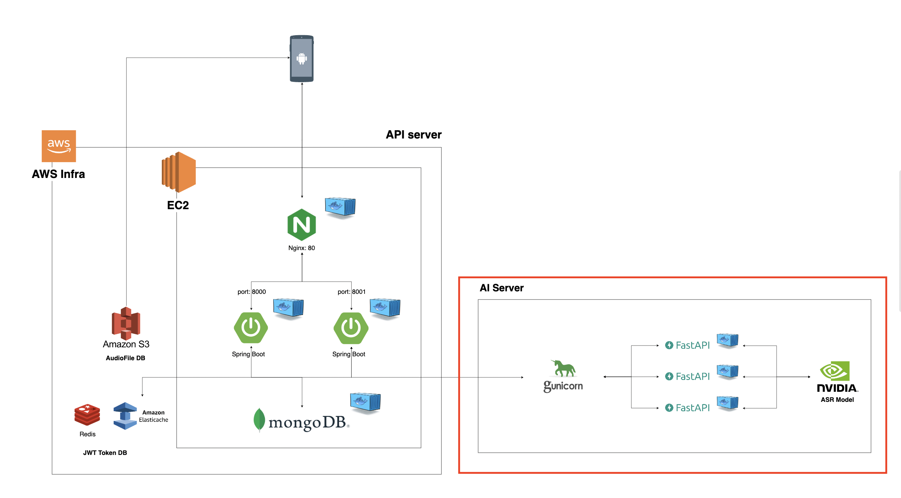
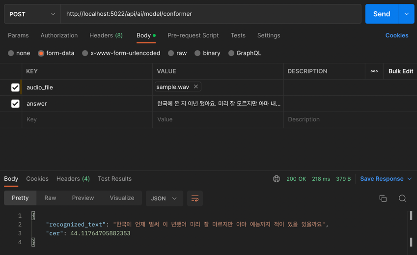
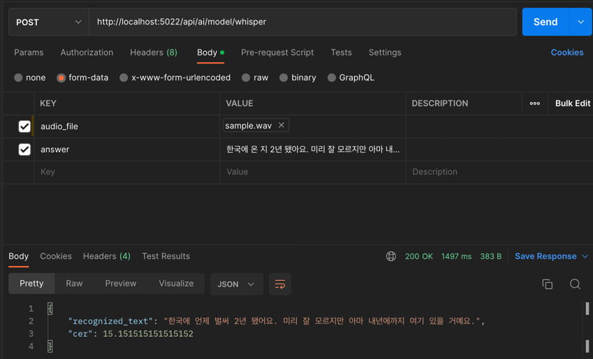

# ai-server
AI server of MASK

Korean Speech Recognition API using Conformer-CTC and Whisper



## How to run
To run this code, you need ffmpeg.exe and .nemo file.

Those files are not in this repository due to the insufficient capacity.

If you need those files, contact 9997ijh@gmail.com
```sh
# Build Image
docker build -t {tag-name} .
# Run container
docker run -p {your host port}:5022 --name {container-name} {tag-name}
```

- Using Swagger
    

- Using Postman
  - Conformer-CTC
    
  - Whisper
    


## Reference
- https://github.com/openai/whisper
- https://ffmpeg.org/
- https://github.com/kkroening/ffmpeg-python
- https://koreascience.kr/article/JAKO202128837810056.pdf

If you want ipynb version of the model, visit these repositories. 

- [conformer-ctc](https://github.com/Skrrs/ml_conformer_ctc)
- [whisper](https://github.com/Skrrs/ml_whisper)